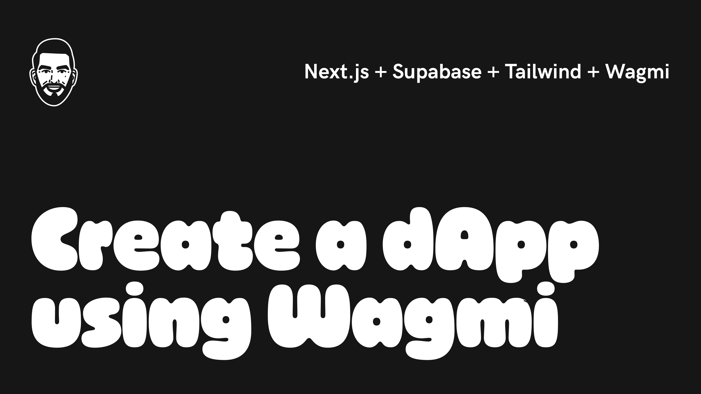

# Wagmi dApp Starter Kit

This proof-of-concept uses [Wagmi](https://wagmi.sh/) to connect and save Web3 wallet addresses and metadata to [Supabase](https://supabase.com/) using a connected wallet's address within a [Next.js](https://nextjs.org/) application.

### Deploy on Vercel

Before deploying, read `Get Started` and ensure that you have created the required environment variables.

# Getting Started

1. `git clone https://github.com/surgieboi/nextjs-wagmi-supabase.git`
2. `npm install`
3. Rename the `.env.example` file to `.env`
3. Create an account on [Alchemy](https://www.alchemy.com/); once logged-in, copy and paste your API Key within your `.env` file 
4. Create an account on Supabase; once logged-in, copy and paste your Anon Key and URL within your `.env` file 
5. `npm run dev`
6. Visit [http://localhost:3000](http://localhost:3000)

Additionally, read [Connecting and Using Supabase](#connecting-and-using-supabase), and ensure that you have properly setup your Supabase organization, project, and tables.

Remember, in order to connect a Web3 wallet you will need a wallet extension added to your browser. This proof-of-concept is pre-configured with the following:

- [Coinbase Wallet](https://www.coinbase.com/wallet)
- [MetaMask](https://metamask.io/)
- [WalletConnect](https://walletconnect.com/)
- Injected: which will default to either Coinbase Wallet or MetaMask, and is used more specifically for wallets connected to Brave browsers.

# Connecting and Using Supabase

### Setting up Supabase

Before you can save data from your application, you will need to complete the following:

#### General

1. Create an organization
2. Create a project
3. Proceed to Table Editor

#### Saving Wallet Adddresses

Create a table called, `wallets` and add the following columns:

| Column        | Type           | Primary  | Is Nullable  |
| ------------- |-------------| -----| -----|
| wallet_address      | text | true | false |

Delete the default `id` column and ensure that `wallet_address` is the only Primary value.

Note, you can update table names; however, remember to update their references found throughout `/src/components/SupabaseActions.tsx`.

#### Saving Signed Message Signatures

Create a table called, `signings` and add the following columns:

| Column        | Type           | Primary  | Is Nullable  |
| ------------- |-------------| -----| -----|
| address      | text | false | false |
| signature      | text | false | false |

#### Saving Transaction Metadata

Create a table called `transactions` and add the following columns:

| Column        | Type           | Primary  | Is Nullable  |
| ------------- |-------------| -----| -----|
| tx_hash      | text | true | false |
| amount      | numeric | false | false |
| from      | text | false | false |
| to      | text | false | false |

### supabaseClient.js

Within `/utils` we connect our application to Supabase using `supabaseClient.js`, which then allows us to import `supabase` throughout our components and pages using the following import statement, `import { supabase } from "../../utils/supabaseClient";`.

Note, in order for your application to connect to Supabase, ensure that you've properly updated your `.env` file with your accounts `Anon Key` and `API URL`.

### SupabaseActions Component

Within `/components` we use the `SupabaseActions` to enable connected wallets to:

1. `insert` and `select` a connect wallet's address from Supabase
2. `insert` a completed signing message's signature value using Wagmi's `useSignMessage` hook
3. `insert` a completed send trasnaction's hash value using Wagmi's `usePrepareSendTransaction`, `useSendTransaction` and `useWaitForTransaction` hook

# Dependencies

- Next.js
- Supabase
- [Tailwind](https://tailwindui.com/)
- Wagmi

# Addtional Support

### Tailwind CSS

When using VS Code, Tailwind will initially create 3 warnings; specifically, from `/src/styles/globals.css`. To disable these warnings, visit the VC Code Marketplace and install [PostCSS Language Support](https://marketplace.visualstudio.com/items?itemName=csstools.postcss).

# Contributing

This proof-of-concept uses as an MIT license and is free to use. Moreover, you can create issues and pull requests, as this repository will be maintained and updated as it supports various Web3 MVPs.

For additional information or if you have any questions, feel free to email me at [sergio.m.villasenor@gmail.com](mailto:sergio.m.villasenor@gmail.com) or connect with me on Twitter, [@surgieboi](https://twitter.com/surgieboi).

